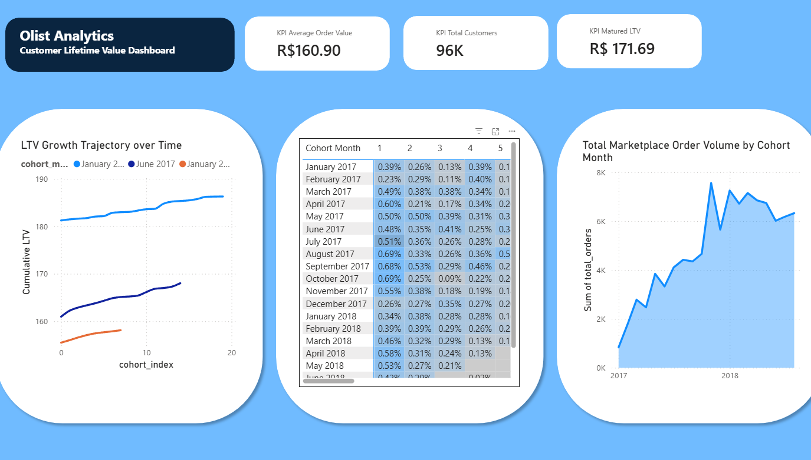

# Olist E-Commerce Advanced Cohort & Lifecycle Analytics

An end-to-end data engineering and business intelligence solution designed to track, calculate, and visualize customer behavior profiles across the Brazilian marketplace **Olist**. The project translates millions of transactional log records into high-level business intelligence insights by revealing customer retention decay patterns and long-term revenue generation behavior.

---

## 🛠️ Tech Stack & Architecture

| Layer | Technology |
|---|---|
| **Database Engine** | PostgreSQL (Local Instance) |
| **Data Pipelines & Modeling** | Advanced SQL (CTEs, Window Functions, ENUM mappings) |
| **BI Platform** | Power BI Desktop |
| **Analytical Framework** | Cohort Analysis, Customer Retention Matrices, Cumulative LTV Modeling |

---

## 🚀 Project Workflow Summary

1. **Data Staging & Database Design** — Structured relational schemas modeled within a local PostgreSQL environment, including explicit primary/foreign key relationships and tailored data constraints.
2. **SQL Transformation Pipelines** — Multi-stage SQL CTEs developed to transform raw transactional records into monthly customer cohorts and chronological purchasing indexes.
3. **Power BI Dashboard Engineering** — Aggregated analytical datasets integrated into Power BI Desktop to create executive dashboards with custom DAX measures and optimized visualization layouts.
4. **Strategic Insight Extraction** — Finalized analytical outputs evaluated to identify customer retention weaknesses, marketplace purchasing behavior, and long-term monetization limitations.

---

## 📂 1. Database Architecture & PostgreSQL Setup

The foundational phase involved transforming a distributed collection of flat `.csv` archives into an optimized relational database architecture capable of supporting large-scale analytical workloads.

### Database & Table Creation

A dedicated PostgreSQL analytical environment was provisioned using `1_Create_Olist_Database.sql`. A star-schema structure was implemented to organize dimension and fact tables via `2_Create_Olist_Tables.sql`.

**Dimension Tables**
- `customer_info_dim`
- `product_info_dim`
- `sellers_dim`
- `geolocation_dim`

**Fact Tables**
- `orders_fact`
- `order_items_fact`
- `order_payments_fact`

Primary keys and referential integrity constraints were enforced to maintain structural consistency. Specialized data types such as `NUMERIC(11,8)` and `TIMESTAMP` were used to preserve geospatial precision and temporal accuracy.

### High-Volume Data Ingestion

Native PostgreSQL `COPY` operations defined within `3_Modify_Olist_Tables.sql` were used to ingest millions of operational records directly into the database. UTF-8 encoding constraints were configured to safely process Portuguese language character sets contained within the raw marketplace datasets.

---

## ⚡ 2. Advanced Analytics: SQL Transformation Pipelines

To evaluate marketplace health beyond absolute sales volume, two advanced analytical SQL pipelines were developed to measure customer retention behavior and long-term customer value generation.

---

### 🔍 Query 1: Customer Cohort Retention Analysis

**Objective**

Group customers into acquisition cohorts based on their earliest recorded purchase month and track customer return activity across subsequent monthly periods.

**Core Analytical Logic**

1. The `cohort_months` CTE identified the earliest purchase timestamp associated with every unique customer.
2. The `index` CTE calculated the chronological month offset (`cohort_index`) between the acquisition month and future purchases.
3. The final aggregation summarized distinct returning customer counts across every cohort period.

**SQL Implementation**

```sql
WITH cohort_months AS (
    SELECT 
        customer_info.customer_unique_id,
        DATE_TRUNC('month', MIN(orders.order_purchase_timestamp)) AS cohort_month
    FROM orders_fact AS orders
    INNER JOIN customer_info_dim AS customer_info 
        ON orders.customer_id = customer_info.customer_id
    GROUP BY customer_info.customer_unique_id
),

index AS (
    SELECT
        cm.customer_unique_id,
        cm.cohort_month,
        DATE_TRUNC('month', orders.order_purchase_timestamp) AS order_month,
        (
            (
                EXTRACT(YEAR FROM DATE_TRUNC('month', orders.order_purchase_timestamp)) 
                - EXTRACT(YEAR FROM cm.cohort_month)
            ) * 12
        ) +
        (
            EXTRACT(MONTH FROM DATE_TRUNC('month', orders.order_purchase_timestamp)) 
            - EXTRACT(MONTH FROM cm.cohort_month)
        ) AS cohort_index
    FROM orders_fact AS orders
    INNER JOIN customer_info_dim AS customer_info 
        ON orders.customer_id = customer_info.customer_id
    INNER JOIN cohort_months AS cm 
        ON customer_info.customer_unique_id = cm.customer_unique_id
)

SELECT
    index.cohort_month,
    index.cohort_index,
    COUNT(DISTINCT index.customer_unique_id) AS unique_customer_count
FROM index
GROUP BY 
    index.cohort_month,
    index.cohort_index
ORDER BY 
    index.cohort_month,
    index.cohort_index;
```

---

### 💰 Query 2: Customer Lifetime Value (LTV) Trajectory

**Objective**

Evaluate cumulative revenue accumulation behavior across customer cohorts to measure long-term monetization efficiency and customer value generation.

**Core Analytical Logic**

1. Baseline acquisition cohorts and chronological purchase indexes were generated similarly to Query 1.
2. The `order_revenue` CTE consolidated fragmented payment rows into unified order-level revenue totals.
3. The `cohort_sizes` CTE calculated the total customer population entering each acquisition cohort.
4. Final aggregations summarized cumulative revenue generation and order activity over time.

**SQL Implementation**

```sql
WITH cohort_months AS (
    SELECT 
        customer_info.customer_unique_id,
        DATE_TRUNC('month', MIN(orders.order_purchase_timestamp)) AS cohort_month
    FROM orders_fact AS orders
    INNER JOIN customer_info_dim AS customer_info 
        ON orders.customer_id = customer_info.customer_id
    GROUP BY customer_info.customer_unique_id
),

index AS (
    SELECT
        orders.order_id,
        cm.cohort_month,
        (
            (
                EXTRACT(YEAR FROM DATE_TRUNC('month', orders.order_purchase_timestamp)) 
                - EXTRACT(YEAR FROM cm.cohort_month)
            ) * 12
        ) +
        (
            EXTRACT(MONTH FROM DATE_TRUNC('month', orders.order_purchase_timestamp)) 
            - EXTRACT(MONTH FROM cm.cohort_month)
        ) AS cohort_index
    FROM orders_fact AS orders
    INNER JOIN customer_info_dim AS customer_info 
        ON orders.customer_id = customer_info.customer_id
    INNER JOIN cohort_months AS cm 
        ON customer_info.customer_unique_id = cm.customer_unique_id
),

order_revenue AS (
    SELECT 
        order_id,
        SUM(payment_value) AS total_order_revenue
    FROM order_payments_fact
    GROUP BY order_id
),

cohort_sizes AS (
    SELECT
        cohort_month,
        COUNT(DISTINCT customer_unique_id) AS total_starting_customers
    FROM cohort_months
    GROUP BY cohort_month
)

SELECT
    index.cohort_month,
    cs.total_starting_customers,
    index.cohort_index,
    SUM(order_revenue.total_order_revenue) AS total_revenue,
    COUNT(DISTINCT index.order_id) AS total_orders
FROM index
INNER JOIN order_revenue
    ON index.order_id = order_revenue.order_id
INNER JOIN cohort_sizes AS cs
    ON index.cohort_month = cs.cohort_month
GROUP BY
    index.cohort_month,
    cs.total_starting_customers,
    index.cohort_index
ORDER BY
    index.cohort_month ASC,
    index.cohort_index ASC;
```

---

## 📊 3. Query Results & Aggregated Data Outputs

Execution of the analytical pipelines condensed large-scale transactional logs into structured summary datasets optimized for visualization and BI reporting.

| Output File | Description |
|---|---|
| `olist_cohort_data.csv` | Customer retention matrix data — tracks returning customer counts across monthly cohort intervals |
| `Olist_Cohort_LTV_Data.csv` | Cohort-based revenue and order metrics — includes cohort population sizes, cumulative revenue, and order activity progression |

---

## 🎨 4. Power BI Engineering & Executive Dashboard Design

The finalized datasets were integrated into Power BI Desktop to construct a professional executive analytics dashboard focused on customer retention and marketplace monetization behavior.

### Dashboard Layout & UI Design

- **Executive Header Layout** — Dark navy visual framing against a light workspace background for structured top-banner hierarchy.
- **Container-Based Visualization** — Rounded rectangular containers used to isolate dashboard sections and improve visual segmentation.
- **Typography Optimization** — Font scaling and spacing adjustments to eliminate visual clutter, improve KPI emphasis, and remove unnecessary scroll behavior.
- **Whitespace Management** — Visual padding and chart scaling refinements to improve readability across all dashboard components.

---

### 🧪 Custom DAX Measures

#### 1. Cumulative LTV

Calculates cumulative customer lifetime value by progressively summing historical cohort revenue and dividing by the original cohort population size.

```DAX
Cumulative LTV = 
VAR CurrentIndex = MAX('Olist_Cohort_LTV_Data'[cohort_index])

VAR StartingCustomers = 
    MAX('Olist_Cohort_LTV_Data'[total_starting_customers])

VAR RunningRevenue = 
    CALCULATE(
        SUM('Olist_Cohort_LTV_Data'[total_revenue]),
        'Olist_Cohort_LTV_Data'[cohort_index] <= CurrentIndex,
        REMOVEFILTERS('Olist_Cohort_LTV_Data'[cohort_index])
    )

RETURN 
    DIVIDE(RunningRevenue, StartingCustomers)
```

> Captures the active cohort progression month → aggregates all historical revenue up to the selected index → removes restrictive filtering for cumulative calculation → normalizes against original cohort population.

---

#### 2. KPI Average Order Value

Calculates marketplace Average Order Value (AOV) by dividing total revenue by total order volume.

```DAX
KPI Average Order Value = 
DIVIDE(
    SUM('Olist_Cohort_LTV_Data'[total_revenue]),
    SUM('Olist_Cohort_LTV_Data'[total_orders])
)
```

> Aggregates total revenue and order counts across all cohorts to produce a per-transaction value benchmark.

---

#### 3. KPI Matured LTV

Evaluates the average mature-stage customer lifetime value across cohorts that progressed beyond Month 12.

```DAX
KPI Matured LTV = 
AVERAGEX(
    SUMMARIZE(
        'Olist_Cohort_LTV_Data', 
        'Olist_Cohort_LTV_Data'[cohort_month]
    ),
    CALCULATE(
        [Cumulative LTV],
        'Olist_Cohort_LTV_Data'[cohort_index] >= 12
    )
)
```

> Groups by acquisition cohort month → filters to mature cohorts (index ≥ 12) → evaluates cumulative LTV per cohort → produces a stabilized long-term monetization benchmark.

---

### 🖼️ Dashboard Core Components

| Component | Description |
|---|---|
| **Executive KPI Panels** | Summary cards for Average Order Value (`R$160.90`), Total Unique Customers (`96K`), and Matured LTV (`R$171.69`) |
| **LTV Growth Trajectory** | Line chart displaying cumulative lifetime value expansion across cohort progression periods |
| **Cohort Retention Heatmap** | Conditional formatting matrix visualizing retention decay and repeat purchase concentration |
| **Order Volume Timeline** | Area chart tracking marketplace transaction growth across historical calendar periods |


---

## 💡 5. Strategic Insights & Discoveries

### ⚠️ Severe Retention Decay

The retention matrix revealed an immediate and substantial customer drop-off after Month 0 across nearly all acquisition cohorts. This indicates the marketplace primarily functions as a transactional purchasing platform rather than a habitual ecosystem.

### 📉 Dominance of Single-Purchase Customers

Approximately **97% of customers** completed only a single purchase throughout their observed lifecycle. The low retention rates in the cohort matrices reflect genuine marketplace purchasing behavior rather than computational anomalies.

### 🚀 Strategic Business Implications

The findings suggest that **Customer Acquisition Cost (CAC) efficiency** is critically important given limited long-term repeat purchasing. Revenue expansion strategies would likely benefit from:

- Post-purchase retention systems
- Customer loyalty mechanisms
- Subscription structures
- Personalized re-engagement campaigns